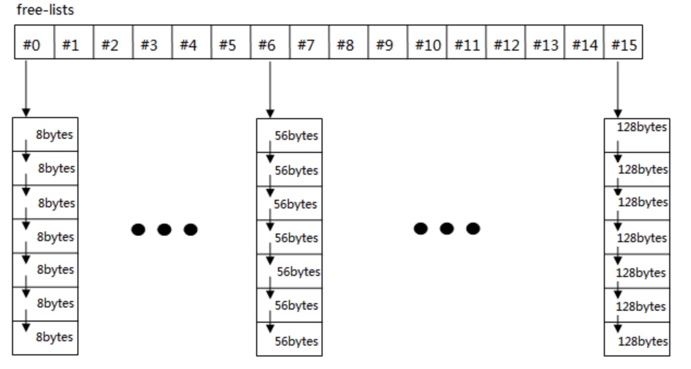
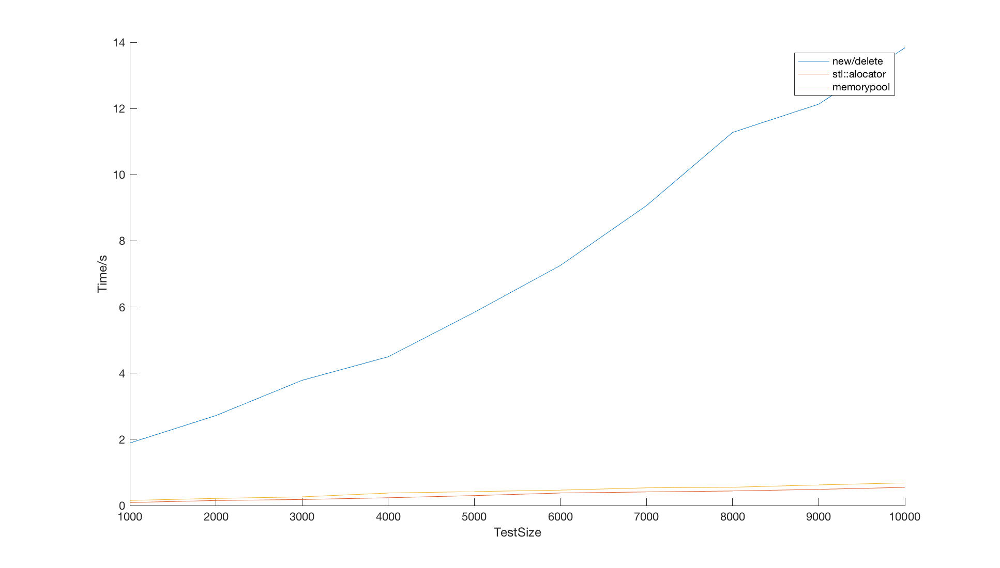

# STL Vector Memory Pool

# 1. Overview 

**Standard Template Library** provides a mechanism of memory allocation and deallocation for **STL Containers**, known as **std::allocator**.While **stl::allocator** has different implementation versions vary with different versions of **compiler** and **C++ standard library**. Compared to a simple version of memory management implemented with only **new** and **delete**, **stl::allocator** has the advantages of **reducing quantity of memory fragments** and **optimize memory allocation speed** in the meanwhile.  My job is to implement a memory allocator for **STL** **vector** and **list** and optimize it using **memory pool**, supporting arbitrary memory size allocation request. Memory pool maintain several memory blocks for allocation, avoiding considerable cost of frequent memory applying operation from system. Because there are so many kinds of memory pool version, it should be noted that the memory pool implemneted by myself is based on **"Freelists"**.


# 2. Principle Introduction 

The following figure shows the architecture of **memory pool** based on **"Freelists"**:



Class memory pool has 16 freelists in total, using 8-byte alignment standard (efficient for large number of allocations). As shown above, each freelist is defined to maintain equal size memory blocks. When memory application of size **n** occurs, the memory pool will find the **"optimal“** freelist for allocation, which mean the **size of memory block** in this freelist is closest to user's request of size **n**. Then this block will be returned to user and pointers will be modified. Then one round of allocation ends. When this freelist **lacks of memory for allocation**. Then memory pool will be **expanded** on this freelist for futher allocation. In another case, when memory block allocated should be returned, it will be **returned to memory pool rather than operating system**, bringing befits of father memory allocation in the future.


# 3. Environment 

## SYETEM 

**Windows 10 (Virtual Machine On MacOS)**

## IDE   

**Visual Studio 2017**

## SDK   

**Windows SDK, version 10.0.17134.0**

## Other Hardware 

**Memory:** 16GB 2133MHz LPDDR3

**CPU:** 2.9 GHz Intel Core i7


# 4. File Structure 

- README.md: markdown file
- memorypool
  + Debug: executable file folder
  + memorypool: containing source code, head file and other dependancies
  + memorypool.sln: project file for **Visual Studio 2017**


# 5. USAGE 

## How to build 

Simply open memorypool.sln in **Visual Studio 2017—>Generate a solution—>Run**

Or you can build with source code and head file but feasibility may not be guranteed.


# 6. Class Declaration Specification 

## 6.1 Standard Interfaces 

Interfaces of **stl::allocator** which must be conformed with:

``` c++
template<typename T>
class MemoryPool
{
public:

	//some typedef
	typedef T value_type;					//type value
	typedef T *pointer;						//type pointer
	typedef const T *const_pointer;			//const type pointer
	typedef T &reference;					//type reference
	typedef const T &const_reference;		//const type reference
	typedef size_t size_type;				//size_t alias
	typedef ptrdiff_t difference_type;		//difference of poitner value

	//rebind allocator
	template <class U>
	struct rebind
	{
		typedef MemoryPool<U> other;
	};
    
    //member functions
    
    //allocate memory
	T *allocate(size_type n = 1, const void *hint = 0);

	//return memory to memory pool or operating system
	void deallocate(T *p, size_type n = 1);

	//object constructor, copy initialization
	void construct(pointer p, const T &value);

	//object destructor, call destructor
	void destroy(pointer p);
    
	//reload destructor
	void destroy(T *first, T *last);
    
	//get address
	pointer address(reference x);

	//get const address
	const_pointer address(const_reference x);
}
```


## 6.2 Other Member Variables And Member Functions 

**Member Variables:**

``` c++
private:
	static const int Align = 8;                        //bytes for alignment
	static const int Maxbytes = 128;                   //maximum bytes of freelists
	static const int NumberOfLists = Maxbytes / Align; //size of freelists
	static const int NumberOfAddedNode = 20;           //default add 20 nodes to the lists
```

**Member Functions:**

``` c++
private:
	static inline size_t ROUND_UP(size_t bytes) { return (((bytes)+(size_t)Align - 1) & ~((size_t)Align - 1)); } 	//calculate round up quantity by 8

	//union to manage freelists, linked lists
	union Obj {
		union Obj *next;
		char data[1];
	};

	static Obj *freelists[NumberOfLists]; //freelists declaration
	static inline size_t index_freelist(size_t bytes)	//calculate index of freelists according to size specified
	{
		return (((bytes)+(size_t)Align - 1) / (size_t)Align - 1);
	}
	static void *refill(size_t n);                      //padding freelists
	static char *blockAlloc(size_t size, size_t &nobj); //refer to memory block for allocation

	static char *startOfFree; //start address for allocation of memory pool
	static char *endOfFree;   //end address for allocation of memory pool
	static size_t heap_size;  //size of heap for allocation
```

**Static Member Variables Initialization:**

``` c++
template <typename T> char* MemoryPool<T>::startOfFree = 0;
template <typename T> char* MemoryPool<T>::endOfFree = 0;
template <typename T> size_t MemoryPool<T>::heap_size = 0; 
template <typename T> typename MemoryPool<T>::Obj* MemoryPool<T>::freelists[] = { 0, 0, 0, 0, 0, 0, 0, 0, 0, 0, 0, 0, 0, 0, 0, 0, };
```


**Note: Please refer to source code for more details, definition of functions will not be listed due to space limitation.**


# 7. Performance Test 

## 7.1 Simply Use "new" and "delete" 

In this case, element assignment is omitted, as a result of which actual time cost is even more. But the difference will not be large.

The figure following shows the performance of using only **"new" and "delete"**

| TestSize | Time/s  |
| :------: | :-----: |
|   1000   | 1.88885 |
|   2000   | 2.71974 |
|   3000   | 3.78392 |
|   4000   | 4.49549 |
|   5000   | 5.83866 |
|   6000   | 7.25714 |
|   7000   | 9.06466 |
|   8000   | 11.2784 |
|   9000   | 12.1318 |
|  10000   | 13.8354 |


## 7.2 Use stl::allocator 


| TestSize |  Time/s  |
| :------: | :------: |
|   1000   | 0.090489 |
|   2000   | 0.151623 |
|   3000   | 0.181994 |
|   4000   | 0.234633 |
|   5000   | 0.300228 |
|   6000   | 0.378082 |
|   7000   | 0.410464 |
|   8000   | 0.439271 |
|   9000   | 0.488316 |
|  10000   | 0.548868 |


## 7.3 Use MemoryPool 


| TestSize |  Time/s  |
| :------: | :------: |
|   1000   | 0.154164 |
|   2000   | 0.215237 |
|   3000   | 0.262408 |
|   4000   | 0.376538 |
|   5000   | 0.421113 |
|   6000   | 0.465753 |
|   7000   | 0.534237 |
|   8000   | 0.551913 |
|   9000   | 0.622731 |
|  10000   | 0.684331 |


## 7.4 Figure 

Performance of **new/delete**, **stl::allocator** and **memory pool**:



 Performance of  **stl::allocator** and **memory pool** only:


# 8. Analysis Of Performance 

As the tables and figures above show, using **"new"** and **"delete"** is inefficient. In contrast, **stl::allocator** and **memory pool** show good performance in terms of program efficiency, while **stl::allocator** performs better to some extend. Time complexity is difficult to analyze because lack of knowledge about memory management of operating system. It can be concluded that **stl::allocator** may be implemented using **memory pool** or other technique like **ring cache**, rather than simple packaging of **"new"** and **"delete"**.


# 9. Credit 

- **Author**

  - **Name:** Zecheng Qian
  - **Student ID:** 3160102418
  - **Major:** Information Engineering

- **Teacher**

  + WeiWei Xu

    

    

    

 

